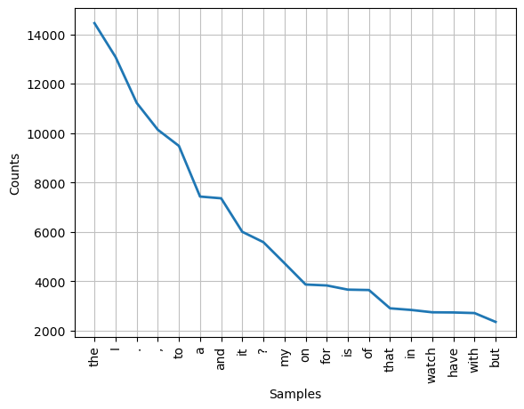
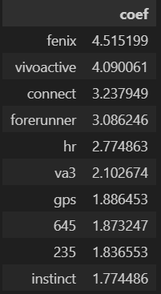

# Project 3: Webscraping, API, and NLP

## Problem Statement
Research & Development Team and digital mareting team would like to improve Garmin product lines and inform data scientist team gather data from "Garmin" and "Apple Watch" subreddits via Reddit.com (Social Voice), how these two brands effective on the reddit users in terms of technical, device usage, and other features of smart watch related. For example, when users from Apple Watch switched to use Garmin Smart Watch, how did they feel? and Particular Garmin Users are still satisfied on their products? (Fenix, Forerunner, and other series)

Well, I would like to know that which words are highly mentioned about these watches and predict the words from title and selftext which subreddit is Garmin or Apple Watch.

## Data Collection
To collect data from reddit.com, I used webscraping method by instansitating Chrome webdriver, and then set up start date. After that, I used beautifulsoup to scrape data from website. Before I scrape of all posts, I tried one post first to make sure that it can be scraped. Then, I scraped from year 2015-01-01 til 2019 (I tried to scrape the latest posts, but there are many posts I got here.)

## Data Cleaning
After I got the data, I concatnated 2 csv files (garmin_df and applew_df) into 1 csv file (watch_df), then I started to clean by using drop_dubplicate. Plus, I used regular expression to find emoji and \n, and then, I removed these two words and keep other words to their cells. After that,I used drop_null, `[deleted]`, and `[removed]`. Now, data is cleaned, and then I concated between title and text columns to be title_text column because it is going to be used for countvectorize.

I divided 2 notebooks (scrape_applew_reddit and scrape_garmin_reddit), and save to csv files(garmin_df.csv and applew.csv).

## Exploratory Data Analysis

This is wordcloud I got from before vectorize, tokenize and other methods. 

This is frequency distribution before cleaning. There are many words which may not predict which one is garmin or apple watch.

This is after cleaning data. When I felt the visualized above may not be effective. Then, I used custom stopwords by define function to remove punctuation marks, articles(a,an,the), Pronoun(I, he, she, it) to remove them.

## Evaluation and Conceptual Understanding
Before I create models, I used countvertorized (CVEC) and TVEC, and then I applied 10 models (Naive Bayes, Random Forest, Adaboost, Logistic Regression, and SVC)

### Multinomials Naive Bayes

### Random Forest

### Logistic Regression

### Adaboost

### SVC

**Best Model Ouput**

Lastly, I got the best model which is `Logistic Rregression` with `CVEC` which train score: 96% & test score: 94% (good fit) 
and accuracy, precision, recall, and F1 score: 93% all the same.

### Error Analysis
#### Misclassified Posts

I found that there are some posts are not correct predicted above. For example, Best watch apps for working out at gym? The prediction gave me "Garmin", but it is actually "Apple Watch". That means the prediction is false positive. On the other hand, How to get the g96 Mark Waypoint function? The prediction gave me "Apple Watch", but it is actually "Garmin". This means the prediction is false negative.

### Feature Analysis

This hozizontal bar graph tells that what reddit users talked about smart watch the most by word. Most of y-axis variables are talked about Garmin related, for example, fenix, vivoactive, forerunner, 235, 645 (Garmin Series) and other features. 

This table showed the most important words for each subreddit. Coefficient number in the table shows how many times in exponential to show posts. For example, 3.79 times of fenix will show on the posts.

## Conclusion
Based on the results above, the best model is `Logistic Regression` with CVEC.

Sample Sentences:
- Vivoactive HR - Avg Calories Out over time?
**Predict:** Garmin

- What languages are supported by WatchOS 2?
**Predict:** Apple Watch

Therefore, there are posts that users mentioned about Smart Watch brands in the right way.

To answer the problem statement, fenix serie, vivoactive, and Garmin connect app is right predicted, it got the highest score on coefficient that R&D team and digital marketing team will look through on the next step in csv file from data scientist team gave (Develop products and app)

## Recommendation
1. To be make more prediction, tokenize and lemmatize can increase significant scores(precision, recall, F1 and other scores).
2. Use Gaussian Naive Bayes, Voting, and other models to find other resuls, not only models that I created.

## Limitation
- The context or the meaning of a sentence or phrase can depend on behaviour of reddit users
- The data has to be collected from other competitors, for example, Suunto, Mi Watch, and other brands
